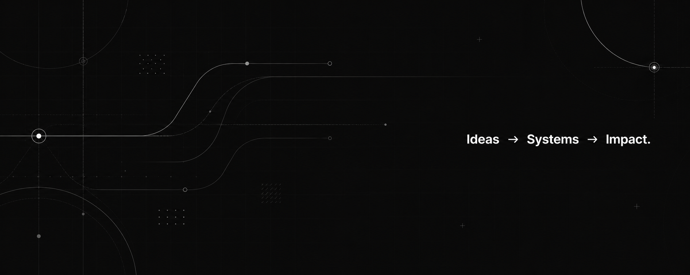

<p align="center">
  
</p>

<!-- ====================== -->

<!--      HERO SECTION      -->

<!-- ====================== -->

<h1 align="center">
Hi 👋 I'm Nitish
</h1>

<p align="center">
<b>AI Engineer • Full Stack Developer • Automation Builder</b>
</p>

<p align="center">
Building intelligent products that solve real-world problems through AI, automation, and thoughtful design.
</p>

<p align="center">

[Portfolio](https://nitishportfolio-two.vercel.app/) •
[GitHub](https://github.com/NITISH-027) •
[LinkedIn](https://www.linkedin.com/in/nitishprabagaran)

</p>

---

# About Me

I'm a Computer Science student passionate about building products that combine

* Artificial Intelligence
* Backend Engineering
* Automation
* Beautiful User Experiences

Instead of collecting certificates, I focus on building real projects that solve practical problems.

Currently learning

* Large Language Models
* Retrieval Augmented Generation (RAG)
* AI Agents
* FastAPI
* Next.js
* System Design

---

# Tech Stack

### Languages


### AI

* Gemini API
* OpenAI APIs
* Hugging Face
* LangChain
* FAISS
* Sentence Transformers

### Backend

* FastAPI
* Node.js
* REST APIs
* Supabase

### Frontend

* Next.js
* React
* TailwindCSS
* Shadcn UI

### Tools

Git • GitHub • VS Code • Postman • Figma • Vercel

---

# Featured Projects

## AI Customer Support Chatbot

An intelligent chatbot powered by RAG capable of answering questions from custom knowledge bases.

**Tech**

Python • FastAPI • FAISS • Gemini API • Sentence Transformers

Repository

https://github.com/NITISH-027/Chatbot

---

## SamadhaanAI

AI-powered compliance platform helping MSMEs manage delayed payments and automate legal compliance workflows.

Highlights

* AI Invoice OCR
* Compliance Dashboard
* Legal Assistant
* Smart Interest Engine

---

## College Event Bridge

A modern platform for managing and discovering college events.

Built using

Next.js
Supabase
TypeScript

---

## WhatsApp Status Automation

Automation workflows for monitoring and posting updates efficiently.

---

## Telegram Monitoring Bot

Automates notifications and data tracking for teams.

---

# Current Focus

```text
Building AI Products ██████████████░░ 85%

Backend Engineering ████████████░░░░ 75%

System Design ██████████░░░░░░░░░ 65%

Open Source ████████░░░░░░░░░░░░ 50%
```

---

# GitHub Analytics

<p align="center">


</p>

<p align="center">


</p>

---

# 2026 Goals

* Build 20+ production-quality AI projects
* Contribute consistently to Open Source
* Master AI Engineering
* Deep dive into RAG & AI Agents
* Strengthen DSA and System Design
* Grow a portfolio that reflects real-world impact

---

# Philosophy

> "Great software isn't just about writing code.
> It's about solving meaningful problems with elegance."

---

<p align="center">

⭐ Thanks for visiting my profile!

If you like my work, consider following me and checking out my repositories.

</p>
