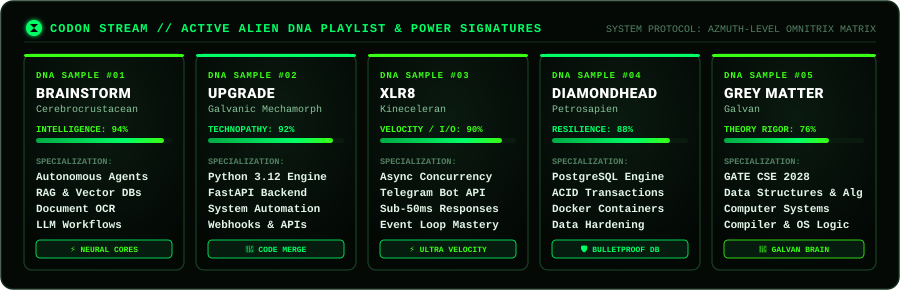

<div align="center">

<!-- ============================================================ -->
<!-- ⌛ OMNITRIX OS // AZMUTH LEVEL 20 GALVAN PRIME INTERFACE    -->
<!-- ============================================================ -->

<a href="https://nitishportfolio-two.vercel.app/" target="_blank">
  
</a>

<br/><br/>

<!-- TOP OMNITRIX DIAL NAVIGATION -->
<p align="center">
  <code><a href="#-plumber-dossier--omnitrix-status">PLUMBER DOSSIER</a></code> •
  <code><a href="#-active-alien-deployments--hero-time">HERO TIME DEPLOYMENTS</a></code> •
  <code><a href="#-codon-stream--alien-dna-playlist">CODON STREAM</a></code> •
  <code><a href="#-active-campaigns--galvan-prime-missions">GALVAN MISSIONS</a></code> •
  <code><a href="#-master-control-milestones--trophies">MASTER CONTROL</a></code> •
  <code><a href="#-omnitrix-telemetry--activity-stream">CORE TELEMETRY</a></code> •
  <code><a href="#-plumbers-badge-comms-relay">HOLO-COMMS</a></code>
</p>

---

</div>

<br/>

<!-- ============================================================ -->
<!-- 🛰️ PLUMBER DOSSIER & OMNITRIX BATTERY STATUS               -->
<!-- ============================================================ -->

### 🛰️ Plumber Dossier &amp; Omnitrix Telemetry

<div align="center">
  
</div>

<br/>

```ini
[OMNITRIX_CORE_SPEC]
OPERATOR      = Nitish Prabagaran [PLUMBER-027]
DEVICE_STATE  = MASTER CONTROL ENGAGED // CODON STREAM STABILIZED
PRIMARY_AFFIN = Python 3.12 • FastAPI Core • Autonomous AI Agents • PostgreSQL Hardening
BASE_SECTOR   = Tamil Nadu, Earth [Sector 2814] // Open for Interstellar Remote Collab
GALVAN_BUFFS  = +45% Async Concurrency // +38% Neural Context Efficiency // +50% System Durability
CURRENT_BATTLE= Transforming Indian MSME compliance & enterprise backends via AI automation
```

---

<!-- ============================================================ -->
<!-- ⚡ ACTIVE ALIEN DEPLOYMENTS // "IT'S HERO TIME"              -->
<!-- ============================================================ -->

### ⚡ Active Alien Deployments // "It's Hero Time"

The Omnitrix dial is locked into four production-grade alien battle protocols:

<table>
  <tr>
    <td width="50%" valign="top">
      <h4><a href="https://github.com/NITISH-027/SAMADHAANAI">🦀 PROTOCOL [BRAINSTORM] &bull; SAMADHAAN AI</a></h4>
      <p><b>Galvanic Compliance &amp; Legal Debt Recovery Neural Core</b></p>
      <p>Automated payment recovery, intelligent legal notice generation, and OCR document verification engineered for MSMEs fighting delayed payments under the MSMED Act.</p>
      <ul>
        <li><b>Alien Form:</b> <code>Brainstorm (Cerebrocrustacean)</code></li>
        <li><b>Tech Weapons:</b> <code>Python</code> • <code>FastAPI</code> • <code>PostgreSQL</code> • <code>Vision AI / OCR</code></li>
        <li><b>Battle State:</b> <code>● PRODUCTION READY // 94% NEURAL ACCURACY</code></li>
      </ul>
      <details>
        <summary><b>🔍 Holographic Decryption: Inspect Architecture</b></summary>
        <br/>
        <pre><code>[CODON_INSPECT] SAMADHAAN-AI
├─ Neural Ingestion: Multi-page invoice PDF stream &amp; validation
├─ Neuro-Analysis: Document OCR + LLM entity extraction &amp; audit
├─ Petrosapien Vault: Relational ledger with dispute timeline tracking
├─ Automated Defense: Legal demand notice generator &amp; dispatch bot
└─ Kineceleran Loop: Non-blocking async queue for bulk invoice processing</code></pre>
        <p align="right"><a href="https://github.com/NITISH-027/SAMADHAANAI"><b>Access Codon Archive &rarr;</b></a></p>
      </details>
    </td>
    <td width="50%" valign="top">
      <h4><a href="https://github.com/NITISH-027/ecosphere-esg">💎 PROTOCOL [DIAMONDHEAD] &bull; ECOSPHERE ESG</a></h4>
      <p><b>Evidence-Native Indestructible Carbon &amp; ESG Ledger</b></p>
      <p>Auditable greenhouse gas (GHG) tracking, carbon footprint accounting, and organizational sustainability metric calculation engine with cryptographic evidence verification.</p>
      <ul>
        <li><b>Alien Form:</b> <code>Diamondhead (Petrosapien)</code></li>
        <li><b>Tech Weapons:</b> <code>Python</code> • <code>FastAPI</code> • <code>PostgreSQL</code> • <code>Data Pipelines</code></li>
        <li><b>Battle State:</b> <code>● LIVE ENGINE // UNBREAKABLE INTEGRITY</code></li>
      </ul>
      <details>
        <summary><b>🔍 Holographic Decryption: Inspect Architecture</b></summary>
        <br/>
        <pre><code>[CODON_INSPECT] ECOSPHERE-ESG
├─ Crystal Storage: Indexed PostgreSQL store with immutable audit trail
├─ Accounting Core: Automated Scope 1, 2, 3 carbon emission pipelines
├─ Evidence Lock: Tamper-evident ledger referencing raw sensor logs
└─ Query Speed: Sub-45ms index scans on multi-year telemetry metrics</code></pre>
        <p align="right"><a href="https://github.com/NITISH-027/ecosphere-esg"><b>Access Codon Archive &rarr;</b></a></p>
      </details>
    </td>
  </tr>
  <tr>
    <td width="50%" valign="top">
      <h4><a href="https://github.com/NITISH-027/MSME">🔄 PROTOCOL [UPGRADE] &bull; MSME GROWTH OS</a></h4>
      <p><b>Mechamorph Business Infrastructure &amp; Automation Core</b></p>
      <p>Merges with small-to-mid business systems to automate inventory pipelines, forecast cash flow runways, and centralize operational telemetry on an intelligent dashboard.</p>
      <ul>
        <li><b>Alien Form:</b> <code>Upgrade (Galvanic Mechamorph)</code></li>
        <li><b>Tech Weapons:</b> <code>Python</code> • <code>FastAPI</code> • <code>Predictive AI</code> • <code>Async Workflows</code></li>
        <li><b>Battle State:</b> <code>● CODE MERGED // ACTIVE PILOT ROLLOUT</code></li>
      </ul>
      <details>
        <summary><b>🔍 Holographic Decryption: Inspect Architecture</b></summary>
        <br/>
        <pre><code>[CODON_INSPECT] MSME-GROWTH-OS
├─ Technopathy Engine: Webhook bridges into accounting spreadsheets
├─ Predictive Core: Machine learning cash flow &amp; invoice forecast models
├─ Automation Circuit: Auto-reconciliation of purchase orders &amp; bank feeds
└─ Plumber Security: JWT role-based access control with token rotation</code></pre>
        <p align="right"><a href="https://github.com/NITISH-027/MSME"><b>Access Codon Archive &rarr;</b></a></p>
      </details>
    </td>
    <td width="50%" valign="top">
      <h4><a href="https://github.com/NITISH-027/telegram-monitor-bot">⚡ PROTOCOL [XLR8] &bull; TELEFLOW BOT</a></h4>
      <p><b>Hyper-Velocity Telegram Operations &amp; Incident Dispatcher</b></p>
      <p>High-throughput automated notification pipeline, server health sentinel, and incident dispatcher bridging backend server telemetry to Telegram channels at sub-millisecond speeds.</p>
      <ul>
        <li><b>Alien Form:</b> <code>XLR8 (Kineceleran)</code></li>
        <li><b>Tech Weapons:</b> <code>Python</code> • <code>FastAPI</code> • <code>Telegram Bot API</code> • <code>Async Webhooks</code></li>
        <li><b>Battle State:</b> <code>● RUNNING SENTINEL // ZERO DOWNTIME</code></li>
      </ul>
      <details>
        <summary><b>🔍 Holographic Decryption: Inspect Architecture</b></summary>
        <br/>
        <pre><code>[CODON_INSPECT] TELEFLOW-BOT
├─ Hyper-Speed Webhook: Async FastAPI gateway handling burst webhooks
├─ Sentinel Radar: Scheduled cron health pings across microservices
├─ Incident Triage: Priority threshold classification (Critical / Warn / Log)
└─ Non-Blocking I/O: Zero event loop blocking on high-frequency broadcast</code></pre>
        <p align="right"><a href="https://github.com/NITISH-027/telegram-monitor-bot"><b>Access Codon Archive &rarr;</b></a></p>
      </details>
    </td>
  </tr>
</table>

---

<!-- ============================================================ -->
<!-- 🧬 CODON STREAM // ALIEN DNA PLAYLIST                        -->
<!-- ============================================================ -->

### 🧬 Codon Stream &amp; Alien DNA Playlist

<div align="center">
  
</div>

<br/>

<details>
  <summary><b>💾 Expand Azmuth's Full Galvan Engineering Arsenal &amp; Weaponry</b></summary>
  <br/>

| Alien DNA Sample | Species Origin | Primary Technology Armory | Power Rating |
| :--- | :--- | :--- | :---: |
| **🧠 Grey Matter** | Galvan Prime | Data Structures &amp; Algorithms, System Design, Discrete Math, GATE CSE 2028 | `92% [SUPREME]` |
| **🔄 Upgrade** | Galvan B | Python 3.12, FastAPI, Webhook Workflows, Asynchronous Microservices | `94% [MASTER]` |
| **🦀 Brainstorm** | Encephalonus IV | Autonomous AI Agents, RAG Pipelines, Vector Databases, Document OCR | `88% [ADVANCED]` |
| **⚡ XLR8** | Kinet | AsyncIO Non-blocking Loops, Telegram API, Low-latency Endpoints | `90% [HYPER-SPEED]` |
| **💎 Diamondhead** | Petropia | PostgreSQL, Relational Schema Architecture, ACID Hardening, Docker | `86% [ARMORED]` |
| **🔊 Echo Echo** | Sonorosia | Docker Containers, Git/GitHub Actions, Linux CLI, Production Staging | `82% [SCALABLE]` |

</details>

---

<!-- ============================================================ -->
<!-- 🎯 ACTIVE CAMPAIGNS // GALVAN PRIME MISSIONS                -->
<!-- ============================================================ -->

### 🎯 Active Campaigns // Galvan Prime Missions

```diff
+ [PRIORITY 01]  GALVAN SUPREME INTELLECT: GATE CSE 2028
  Species:       Galvan (Grey Matter)
  Progress:      ▓▓▓▓▓▓▓▓▓▓▓▓░░░░░░░░  [60%]
  Directive:     Master Core CS: Algorithms, Operating Systems, Compilers & Computer Architecture.

+ [PRIORITY 02]  AUTONOMOUS MULTI-AGENT SWARMS WITH RAG
  Species:       Cerebrocrustacean (Brainstorm)
  Progress:      ▓▓▓▓▓▓▓▓▓▓▓▓▓▓▓▓░░░░  [82%]
  Directive:     Deploy autonomous reasoning agents capable of multi-turn tool-calling & synthesis.

+ [PRIORITY 03]  ENTERPRISE MECHAMORPH OPEN SOURCE EXPANSION
  Species:       Galvanic Mechamorph (Upgrade)
  Progress:      ▓▓▓▓▓▓▓▓▓▓▓▓▓▓▓▓▓▓░░  [90%]
  Directive:     Harden backend repositories with CI checks, pytest suites, and clean documentation.

+ [PRIORITY 04]  HIGH-CONCURRENCY DISTRIBUTED SYSTEMS
  Species:       Kineceleran (XLR8) + Petrosapien (Diamondhead)
  Progress:      ▓▓▓▓▓▓▓▓▓▓▓▓▓▓░░░░░░  [70%]
  Directive:     Integrate message brokers (Kafka/RabbitMQ) and distributed caching (Redis).
```

---

<!-- ============================================================ -->
<!-- 🏆 MASTER CONTROL MILESTONES // UNLOCKED ACHIEVEMENTS        -->
<!-- ============================================================ -->

### 🏆 Master Control Milestones &amp; Alien Trophies

<table>
  <tr align="center">
    <td width="20%">
      
      <br/><b>Omnitrix Master</b>
      <br/><sub>Unlocked multi-alien engineering transformations</sub>
    </td>
    <td width="20%">
      
      <br/><b>Upgrade Transfusion</b>
      <br/><sub>Built &amp; deployed live MSME enterprise platform</sub>
    </td>
    <td width="20%">
      
      <br/><b>Neural Orchestrator</b>
      <br/><sub>Shipped AI agent &amp; OCR document compliance engines</sub>
    </td>
    <td width="20%">
      
      <br/><b>Diamondhead Ledger</b>
      <br/><sub>Engineered evidence-native ESG accounting vault</sub>
    </td>
    <td width="20%">
      
      <br/><b>GATE CSE '28 Seeker</b>
      <br/><sub>Deep grinding on computer science fundamentals</sub>
    </td>
  </tr>
</table>

---

<!-- ============================================================ -->
<!-- 📊 OMNITRIX TELEMETRY // CORE ACTIVITY STREAM               -->
<!-- ============================================================ -->

### 📊 Omnitrix Telemetry &amp; Core Activity Stream

<div align="center">
  <table border="0">
    <tr align="center">
      <td>
        <a href="https://github.com/NITISH-027">
          
        </a>
      </td>
      <td>
        <a href="https://github.com/NITISH-027">
          
        </a>
      </td>
    </tr>
    <tr align="center">
      <td colspan="2">
        <a href="https://github.com/NITISH-027">
          
        </a>
      </td>
    </tr>
  </table>
</div>

---

<!-- ============================================================ -->
<!-- 📡 PLUMBERS BADGE // INTERSTELLAR HOLO-COMMS                -->
<!-- ============================================================ -->

### 📡 Plumber's Badge Interstellar Holo-Comms

Transmit collaboration requests or mission directives through secured Galvanic frequencies:

<div align="center">

<a href="https://nitishportfolio-two.vercel.app/" target="_blank">
  
</a>
&nbsp;
<a href="https://www.linkedin.com/in/nitishprabagaran" target="_blank">
  
</a>
&nbsp;
<a href="mailto:nitishprabagaran07@gmail.com">
  
</a>

<br/><br/>

```bash
# Hail Plumber Station NITISH-027 via terminal
curl -X POST https://nitishportfolio-two.vercel.app/api/transform \
  -H "Authorization: Bearer AZMUTH_LEVEL_20" \
  -d '{"alien_protocol": "UPGRADE", "directive": "BUILD_SCALABLE_SYSTEMS"}'
```

<sub>OMNITRIX OS // UNIT 027 // POWERED BY AZMUTH GALVAN PRIME TECH // "IT'S HERO TIME"</sub>

</div>
